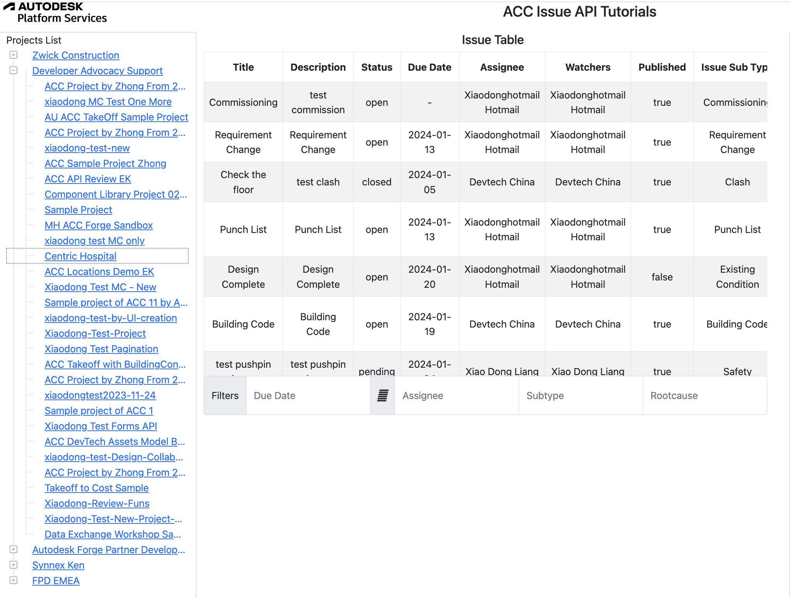

# Basic Export
 
 This is the basic tutorial that dumps issue data and renders them in table view of web application. In the tutorial, we will learn:

 - setup the skeleton of web application
 - build workflow of authentication (3-legged token)
 - get definitions of issue data: issue types, root causes, custom attributes etc.
 - get issue data and orgnize them for table view

 
